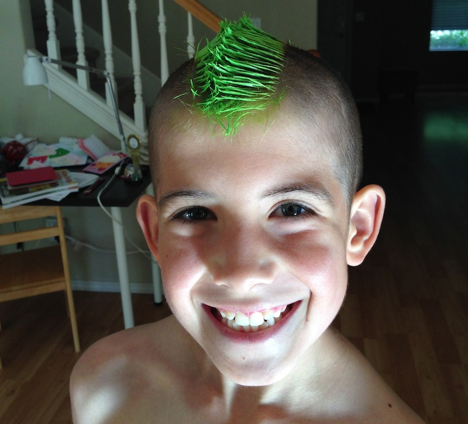
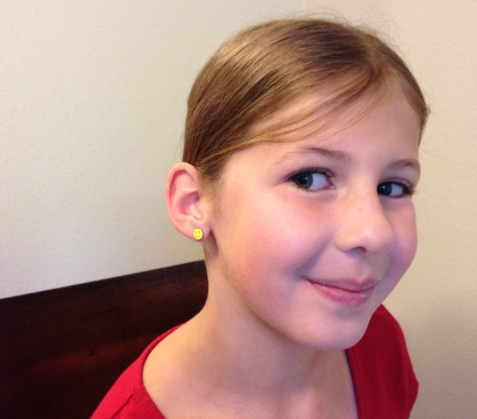
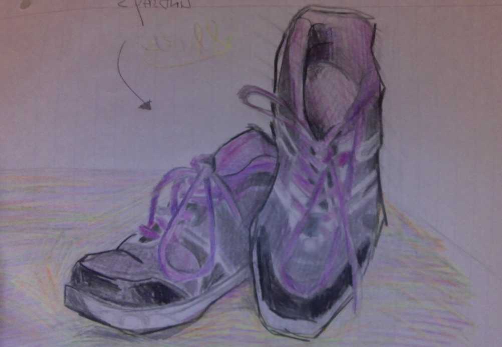
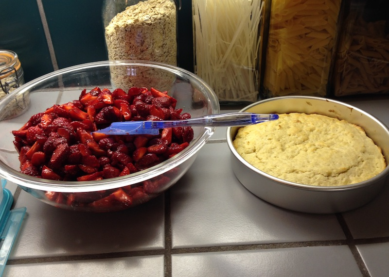
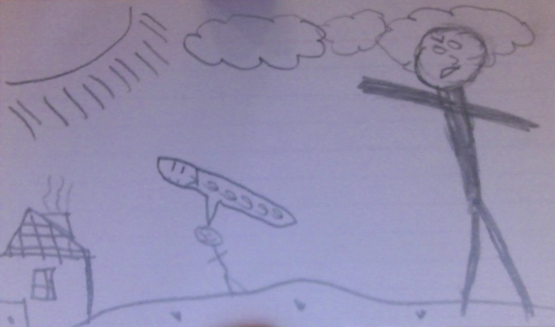
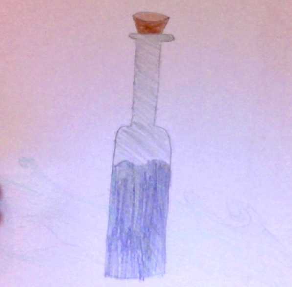

# The Family

\u00A9 2014 Barney Boisvert

## Barney of the Green Woods RRGG

Legendary Creature - Human Legend 5/1

Haste, trample

At end of turn, return Barney of the Green Woods to it's owner's hand.

## Emery of the Green Woods 2WWBB

Enchantment Creature - Human Unicorn 4/5

Bestow {5}{W}{W}{B}

Vigilance, hexproof.

Enchanted creature gets +4/+5 and has vigilance and hexproof.

## Lindsay of the Green Woods 2GGG

Creature - Unicorn Spirit 5/4

Trample

{G}: Lindsay of the Green Woods gets +1/+1 until end of turn.  If activated more than once in a single turn, it dies at end of turn.

## Lindsay's Shoes UG

Instant

Target creature gains trample and first strike until end of turn.

## Scuba Smash RR

Instant

Tap target blue creature with toughness 2 or greater.

*The mountain sprang forth and Vorel swam right into it.*

## Strawberry Shortcake 1WR

Instant

All Humans gain +1/+2 until end of turn.

*Strawberries are to humans as blood is to vampires.*

## Go Big of Go Home 2WB

Instant

All creatures you control get +2/+1 until end of turn.  You lose 3 life.  This loss of life cannot be prevented.

*His love for small creatures would drive him to destruction.*

## Sleep Potion U

Instant

Target creature cannot attack or block until end of turn.

*And goodnight.*