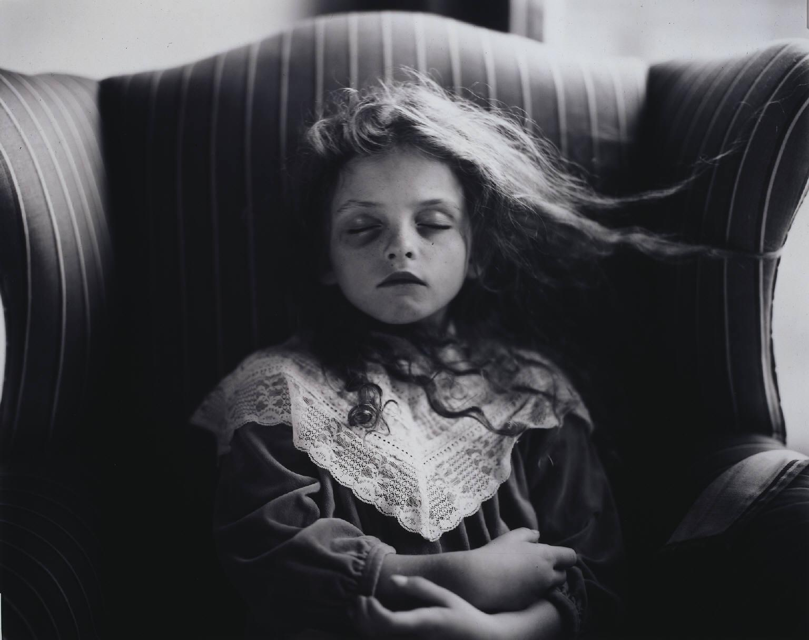
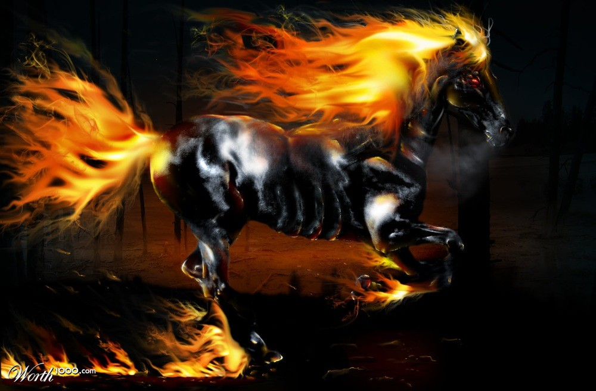
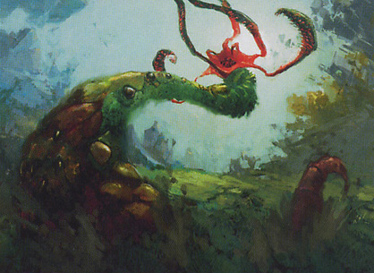

# Test Set

\u00A9 2014 Barney Boisvert

## Sally 1R

Creature - Human 1/1

{U}{T}: Tap target creature and pay 1 life.

*Sally doesn't like you.*

*Or you.*

## Counterspell UU

Instant

Counter target spell.

*How about "never".*
{    -- Barney of the Green Woods}

## Nightmare 5B

Creature - Nightmare Horse \*/\*

Flying

Nightmare's power and toughness are each equal to the number of Swamps you control.

_The thunder of its hooves beats dreams into despair._

Blitz Hellion 2RG
-----------------

Creature - Hellion 7/7

Trample, haste

At the beginning of the end step, Blitz Hellion's owner shuffles it into his or her library.

*Alarans commemorated its appearances with new holidays bearing names like the Great Cataclysm and the Fall of Ilson Gate.*

## Barney of the Green Woods 2WUBRG

Legendary Enchantment Creature - Human Legend 100/100

Indestructable, hexproof

{1}{U}{G}{T}: Every opponent dies in a fire unless all pay {X}{U}{B}{G} or {X}{R}{B}{W} or {X}{X}{B} where X equals your life total.

{For the first time in his life, Barney felt warm.  And hungry.}
