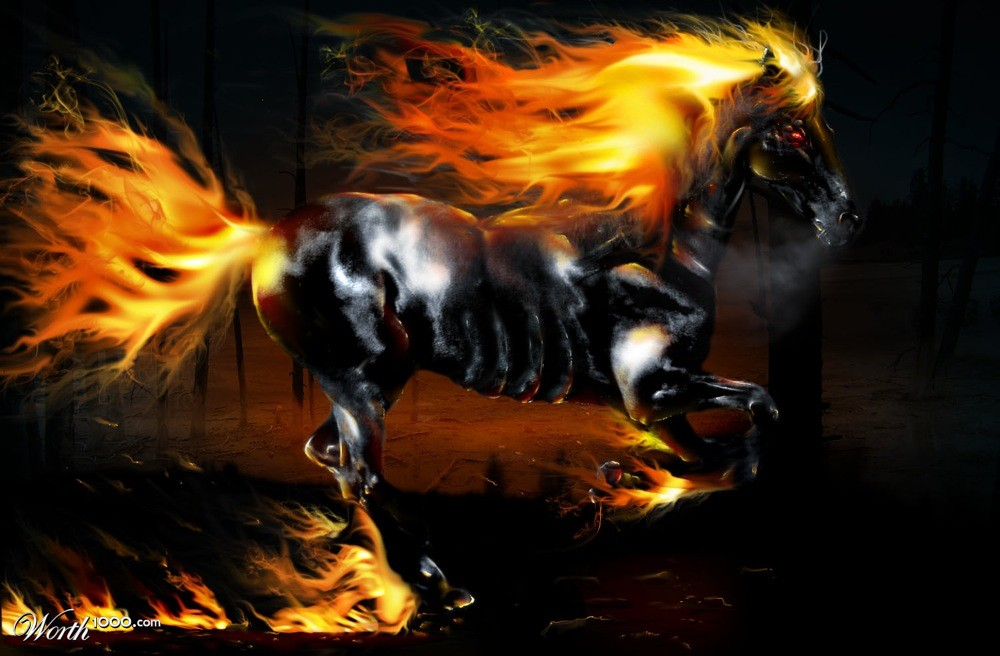
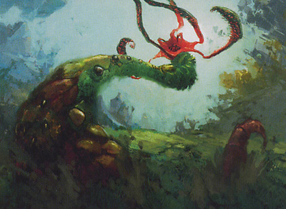
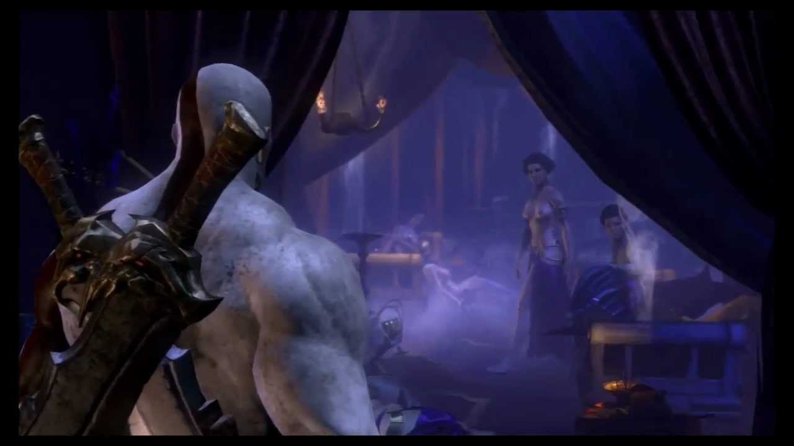
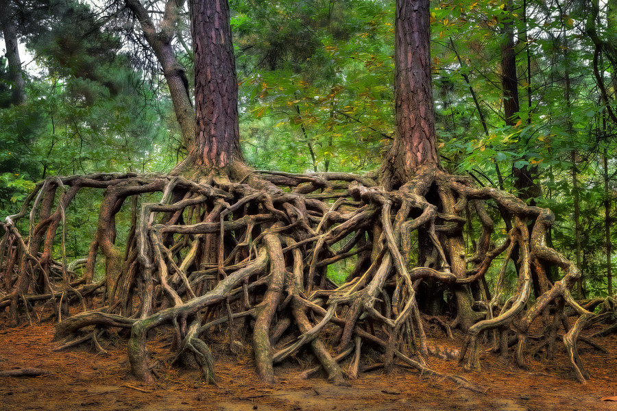
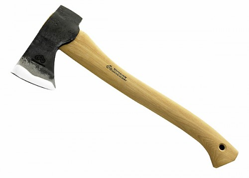

# Test Set

\u00A9 2014 Barney Boisvert

## Sally 1R

Creature - Human

{U}{T}: Tap target creature and pay 1 life.

*Sally doesn't like you.*

_Or you._

1/1

## Counterspell UU

Instant

Counter target spell.

*How about "never".* 
_-- Barney of the Green Woods_

## Nightmare 5B

Creature - Nightmare Horse

Flying

Nightmare's power and toughness are each equal to the number of Swamps you control.

_The thunder of its hooves beats dreams into despair._

\*/\*

Blitz Hellion 3RG
-----------------

Creature - Hellion

Trample, haste

At the beginning of the end step, Blitz Hellion's owner shuffles it into his or her library.

*Alarans commemorated its appearances with new holidays bearing names like the Great Cataclysm and the Fall of Ilson Gate.*

7/7

## Barney of the Green Woods 2{r/w}{u/b}gb

Legendary Enchantment Creature - Human Legend

Indestructable, hexproof

{1}{U}{G}{T}: Every opponent dies in a fire unless all pay {X}{U}{B}{G} or {X}{R}{B}{W} or {X}{X}{B} where X equals your life total.

_For the first time in his life, Barney felt warm. And hungry._

100/100

## Elysian Brothel

Legendary Land

All legendary creatures, gods, and angels, get -1/-1.

_They are selective in their clientele, but their service legendary._

## Sleeping Cherub 2WW

Creature - Angel

Flying, double strike, lifelink

_Serra's children are angels. And fierce._

2/4

The Green Woods 5gg
-------------------

Instant

Untap all Forests.  All Forests become 1/4 green Elemental creatures with reach until end of turn.  They are still lands.

Purphoros' Axe 3
----------------

Artifact

At the beginning of your upkeep, pay {R} or sacrifice Purphoros' Axe.

At the end of your upkeep, choose target creature.  The creature has protection from Forests until your next upkeep.
